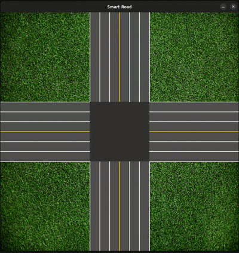

# 🚦 Smart Road - Autonomous Vehicle Intersection

An advanced, traffic-light-free intersection management simulation built with **Rust** and **SDL2**. This project demonstrates a smart algorithmic approach to traffic control specifically designed for the era of Autonomous Vehicles (AVs).

*(Replace this path with your actual GIF showing the cars gliding through the intersection!)*

---

## 🎯 Objectives
The primary goal of this simulation is to solve the classic "Stop-and-Go" traffic jam problem at cross-intersections. By leveraging exact deterministic physics and a Cooperative Intersection Management algorithm, vehicles can adjust their trajectories and speeds dynamically to avoid collisions without relying on traditional, inefficient traffic lights.

---

## ⚙️ Core Features & Physics

* **Smart Routing Algorithm:** Utilizes a Time-To-Collision (TTC) predictive algorithm to determine optimal speeds for conflicting vehicles.
* **Realistic Physics Engine:** Implements fundamental kinematics where velocity, distance, and time are strictly correlated using $v = \frac{d}{t}$.
* **Dynamic Easing (Bonus):** Vehicles utilize Linear Interpolation (Lerp) for smooth acceleration and deceleration, mimicking real-world braking capabilities.
* **Collision Prevention System:** Strict safety distance protocols ensure AVs maintain a positive distance from one another.
* **Cooperative Speed Adjustment:** Vehicles with the right-of-way can slightly accelerate, while yielding vehicles smoothly decelerate, preventing complete stops whenever possible.

---

## 🎮 Simulation Controls

The simulation allows for real-time manual testing and continuous stress-testing.

| Key / Command | Action |
| :--- | :--- |
| **Arrow Up** | Generate a vehicle from South to North. |
| **Arrow Down** | Generate a vehicle from North to South. |
| **Arrow Right** | Generate a vehicle from West to East. |
| **Arrow Left** | Generate a vehicle from East to West. |
| **R** | Toggle continuous random vehicle generation. |
| **Esc** | Terminate simulation and display the Statistics Window. |

---

## 📊 Analytics & Statistics

Upon exiting the simulation (using the `Esc` key), a detailed metrics window is generated to evaluate the efficiency of the smart algorithm during the session:

* **Max throughput:** Total number of vehicles that successfully passed the intersection.
* **Velocity Range:** Maximum and minimum speeds achieved across all vehicles.
* **Time Efficiency:** The longest and shortest time taken by a vehicle to cross the designated intersection zone.
* **Safety Index (Close Calls):** Tracks any instances where vehicles violated the defined critical safety distance margin.

---

## 🛠️ Installation & Running

Ensure you have Rust and the appropriate SDL2 development libraries installed on your machine.

**1. Clone the repository:**
git clone <your_repository_link>
cd smart_road

**2. Run the simulation:**
cargo run --release

---

## 🧪 Unit Testing
The project includes a robust suite of unit tests to verify mathematical accuracy and algorithmic safety. You can run the tests using:

cargo test

The test coverage includes:
* Physics Engine validation for speed and distance calculations.
* Safety Distance Detection algorithms.
* Smart Intersection routing logic for conflicting paths.
* Proper accumulation of internal statistics.

---
**Author:** Othmane Benmbarek# 🚦 Smart Road - Autonomous Vehicle Intersection

An advanced, traffic-light-free intersection management simulation built with **Rust** and **SDL2**. This project demonstrates a smart algorithmic approach to traffic control specifically designed for the era of Autonomous Vehicles (AVs).

*(Replace this path with your actual GIF showing the cars gliding through the intersection!)*

---

## 🎯 Objectives
The primary goal of this simulation is to solve the classic "Stop-and-Go" traffic jam problem at cross-intersections. By leveraging exact deterministic physics and a Cooperative Intersection Management algorithm, vehicles can adjust their trajectories and speeds dynamically to avoid collisions without relying on traditional, inefficient traffic lights.

---

## ⚙️ Core Features & Physics

* **Smart Routing Algorithm:** Utilizes a Time-To-Collision (TTC) predictive algorithm to determine optimal speeds for conflicting vehicles.
* **Realistic Physics Engine:** Implements fundamental kinematics where velocity, distance, and time are strictly correlated using $v = \frac{d}{t}$.
* **Dynamic Easing (Bonus):** Vehicles utilize Linear Interpolation (Lerp) for smooth acceleration and deceleration, mimicking real-world braking capabilities.
* **Collision Prevention System:** Strict safety distance protocols ensure AVs maintain a positive distance from one another.
* **Cooperative Speed Adjustment:** Vehicles with the right-of-way can slightly accelerate, while yielding vehicles smoothly decelerate, preventing complete stops whenever possible.

---

## 🎮 Simulation Controls

The simulation allows for real-time manual testing and continuous stress-testing.

| Key / Command | Action |
| :--- | :--- |
| **Arrow Up** | Generate a vehicle from South to North. |
| **Arrow Down** | Generate a vehicle from North to South. |
| **Arrow Right** | Generate a vehicle from West to East. |
| **Arrow Left** | Generate a vehicle from East to West. |
| **R** | Toggle continuous random vehicle generation. |
| **Esc** | Terminate simulation and display the Statistics Window. |

---

## 📊 Analytics & Statistics

Upon exiting the simulation (using the `Esc` key), a detailed metrics window is generated to evaluate the efficiency of the smart algorithm during the session:

* **Max throughput:** Total number of vehicles that successfully passed the intersection.
* **Velocity Range:** Maximum and minimum speeds achieved across all vehicles.
* **Time Efficiency:** The longest and shortest time taken by a vehicle to cross the designated intersection zone.
* **Safety Index (Close Calls):** Tracks any instances where vehicles violated the defined critical safety distance margin.

---

## 🛠️ Installation & Running

Ensure you have Rust and the appropriate SDL2 development libraries installed on your machine.

**1. Clone the repository:**
git clone <your_repository_link>
cd smart_road

**2. Run the simulation:**
cargo run --release

---

## 🧪 Unit Testing
The project includes a robust suite of unit tests to verify mathematical accuracy and algorithmic safety. You can run the tests using:

cargo test

The test coverage includes:
* Physics Engine validation for speed and distance calculations.
* Safety Distance Detection algorithms.
* Smart Intersection routing logic for conflicting paths.
* Proper accumulation of internal statistics.

---
**Author:** Othmane Benmbarek